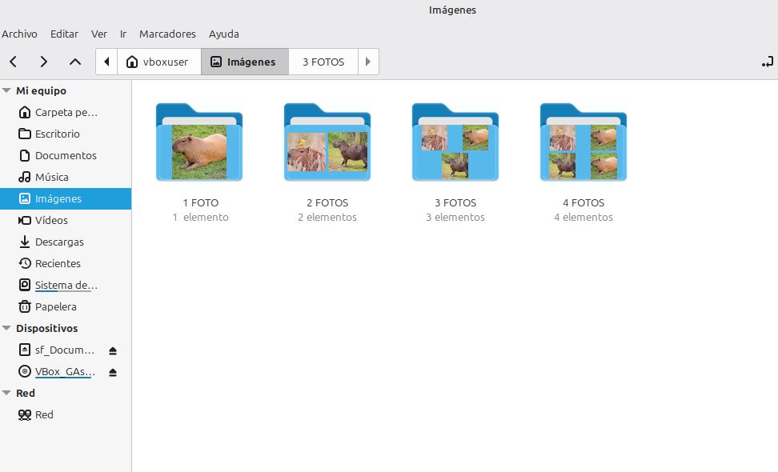

# Nemo Folder Preview

**Photo folder previews that match Mint-Y.**

Nemo Folder Preview creates thumbnails for photo folders in **Nemo**, the file
manager used by Linux Mint Cinnamon. Instead of replacing a folder with a
generic portfolio or CD-case icon, it shows up to four image previews inside a
folder shape based on the selected Mint-Y icon theme.

The result is a folder preview that looks at home in Cinnamon.



## Scope

Nemo Folder Preview is intentionally focused on:

* Linux Mint Cinnamon;
* the Nemo file manager;
* photo folders;
* the Mint-Y family of icon themes.

It is not currently intended to provide music-cover thumbnails, video previews,
or a generic cross-desktop folder-preview implementation.

## Features

* Shows one to four photos as a mosaic inside a Mint-Y folder icon.
* Uses the current Cinnamon Mint-Y theme automatically, or lets you choose a
  specific Mint-Y variant.
* Works with the XDG Pictures directory and with folders added in the
  configuration window.
* Offers light, dark and system interface preferences.
* Includes Spanish and English interface options.
* Lets you exclude folders and clear the thumbnail cache when needed.

## Requirements

Install the dependencies on Linux Mint:

```bash
sudo apt install gettext python3-pil python3-gi gir1.2-gtk-3.0
```

## Installation from source

Clone or download this repository, then run:

```bash
cd nemo-folder-preview
sudo ./install.sh --install
```

Open **Nemo Folder Preview** from the Cinnamon menu to configure it.

The current installer keeps the original technical command name for
compatibility, so it can also be opened from a terminal with:

```bash
cover-thumbnailer-gui
```

## Configuration

In the **Photos** tab you can:

* enable or disable previews for photo folders;
* choose how many images to show (one to four);
* select the Pictures directory or add custom folders;
* use the active Mint-Y theme automatically, or select a Mint-Y variant.

In **Appearance** you can choose the application language and light, dark, or
system interface appearance. Language changes take effect the next time the
application is opened.

After changing the theme or preview style, clear the thumbnail cache or refresh
Nemo if an existing folder still displays an older thumbnail.

For compatibility with the inherited thumbnailer integration, configuration is
currently stored in:

```text
~/.cover-thumbnailer/cover-thumbnailer.conf
```

## Uninstall

```bash
sudo /usr/share/cover-thumbnailer/uninstall.sh --remove
```

## Status

This is an early, working fork. The current priority is a stable and polished
photo-folder preview experience for Linux Mint Cinnamon and Nemo.

## Origin and license

Nemo Folder Preview is a fork of
[Cover Thumbnailer](https://github.com/flozz/cover-thumbnailer), originally
created by Fabien Loison.

Fork development and maintenance: Lucas Gustavo Quiroga.

Copyright © 2009–2026 Fabien Loison. Fork modifications © 2026 Lucas Gustavo
Quiroga.

Nemo Folder Preview is free software licensed under the
[GNU General Public License, version 3 or later](COPYING).
